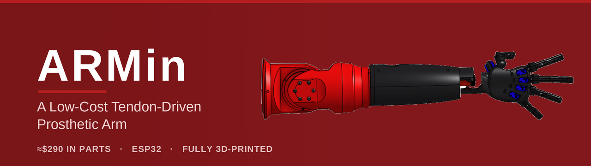
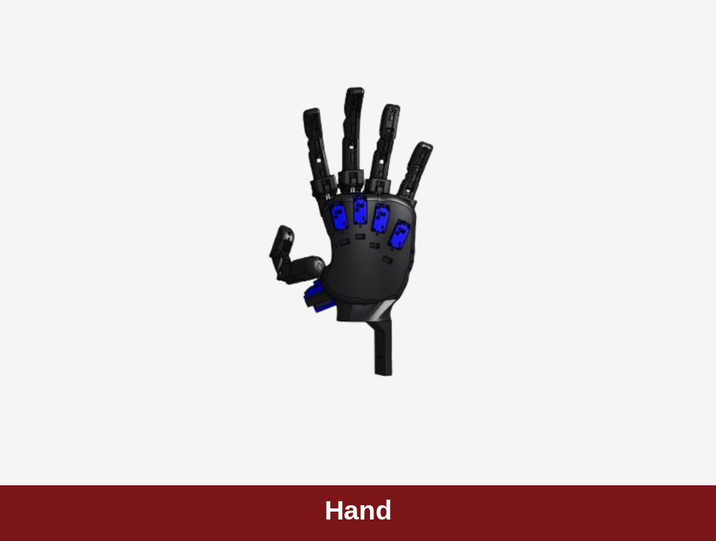
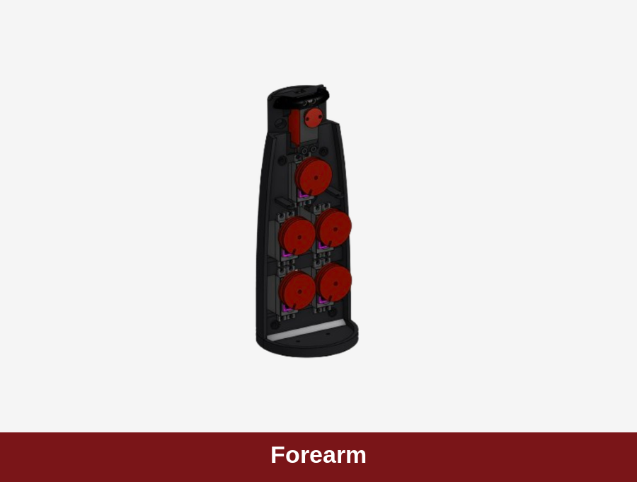
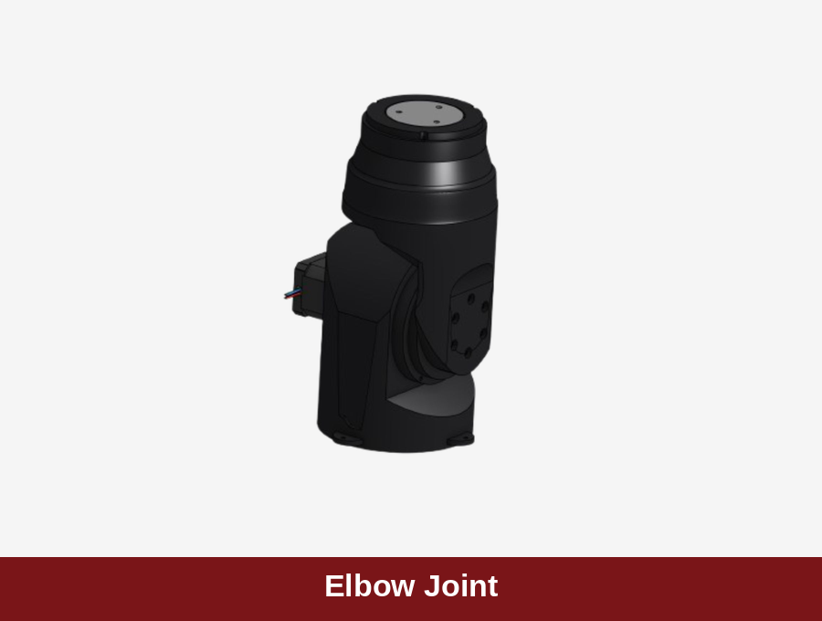
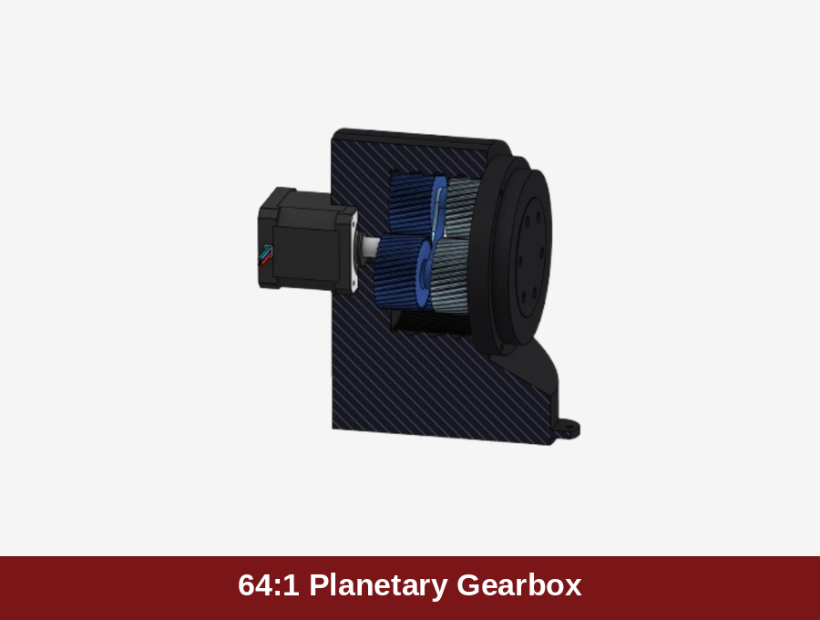
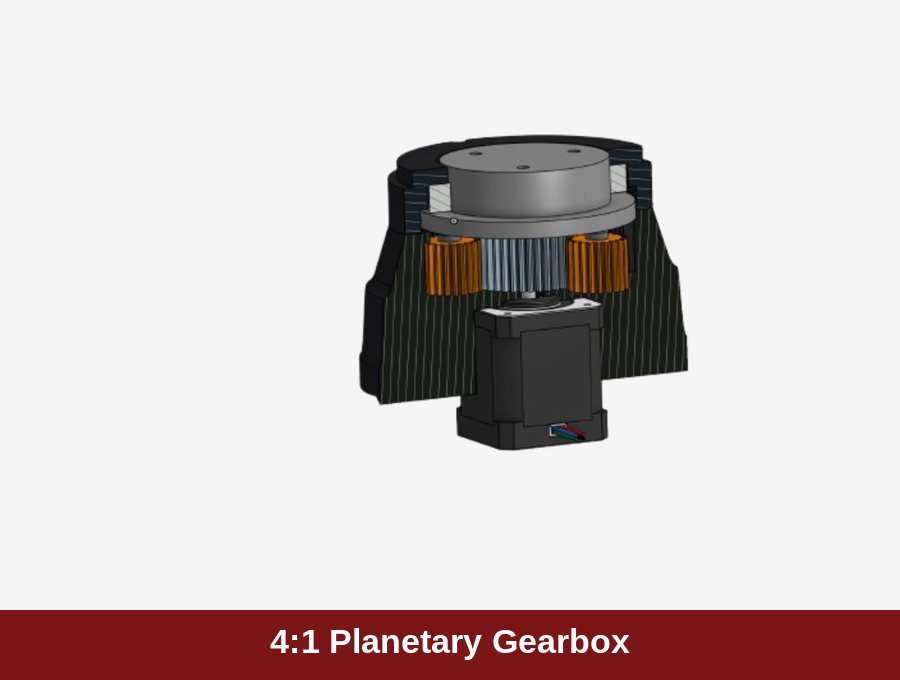
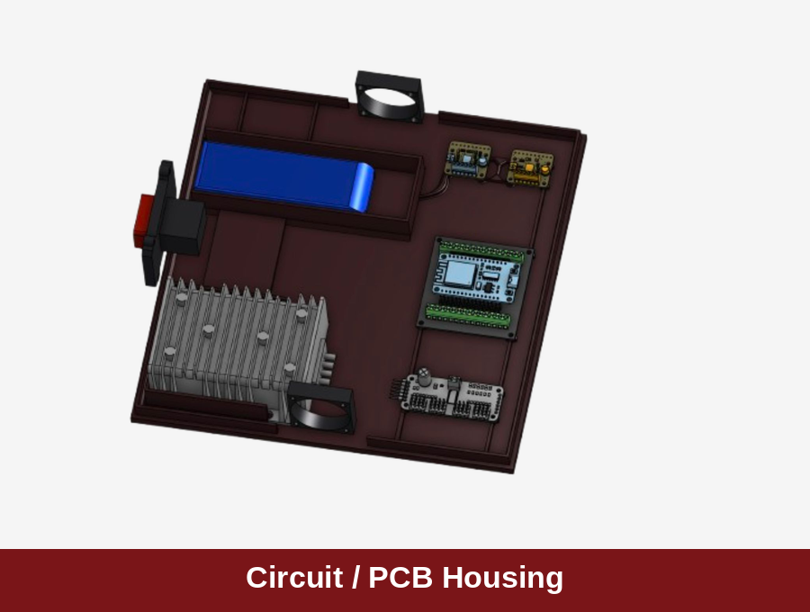

<div align="center">



# Low-Cost Tendon-Driven Prosthetic Arm

**A fully 3D-printed robotic arm built to reach commercial-grade dexterity for roughly 1/150th of the cost.**

[](LICENSE)
&nbsp;
&nbsp;
&nbsp;
&nbsp;

<sub>Bergen Community College · STEM Student Scholars Program · Summer 2026</sub>

</div>

---

## Why it matters

Upper-limb prostheses are expensive enough that many people who need one go without. A multi-grip myoelectric hand runs in the tens of thousands of dollars, and high cost tracks closely with the high rates at which users abandon their devices. ARMin asks a direct question: how much of that dexterity can you recover with hobbyist materials and a 3D printer?

| | ARMin | Multi-grip myoelectric | Standard myoelectric |
|---|---|---|---|
| **Per-unit cost** | **$290.54** | ≈ $46,000 | ≈ $15,000 |
| Structure | Fully 3D-printed (PLA + PETG) | Proprietary | Proprietary |

That's roughly **158× cheaper** than the reported mean acquisition cost of a multi-grip myoelectric arm. Cost figure is ARMin's measured bill of materials; commercial figures are mean acquisition costs by prosthesis class (Kerver et al., 2023).

## Components

Every structural part is printed; the whole arm is driven by eleven servos and two geared stepper joints.

<table>
<tr>
<td width="33%"></td>
<td width="33%"></td>
<td width="33%"></td>
</tr>
<tr>
<td width="33%"></td>
<td width="33%"></td>
<td width="33%"></td>
</tr>
</table>

## How it works

The ESP32 is the whole controller. It hosts a captive-portal web UI over its own WiFi access point and owns the target position of every joint — eleven servos on a PCA9685, plus two NEMA 17 stepper joints at the elbow (64:1 extension, 4:1 roll). There is no companion app and no external computer in the loop. The full axis map, limits, endpoints, and wiring live in [`docs/PROTOCOL.md`](docs/PROTOCOL.md).

## Build & run

### Hardware
See [`docs/bom.md`](docs/bom.md) for the electronics, and [`cad/`](cad/) for the mechanical model — the live Onshape document plus a STEP export you can open or convert (to STL for printing, and so on) in any CAD tool.

### Firmware — build & flash

1. Install [PlatformIO](https://platformio.org/) — the VS Code extension is easiest (search "PlatformIO IDE" in Extensions).
2. Clone the repo:
   ```
   git clone https://github.com/trydell29/Studying-the-efficacy-of-Low-Cost-Tendon-Driven-Prosthetics.git
   ```
3. In VS Code, open the **`firmware/`** folder. PlatformIO detects `platformio.ini` and, on the first build, downloads the pinned libraries automatically.
4. *(Optional, development only)* To also reach the board over your own WiFi at `http://ara.local`, create a secrets file and fill in your 2.4 GHz network:
   ```
   cp firmware/include/Wifi_secrets.example.h firmware/include/wifi_secrets.h
   ```
   `wifi_secrets.h` is gitignored and never committed. Skip this and the board runs on its own access point alone — which is how the arm operates normally.
5. Connect the ESP32 by USB, then **Build** (✓) and **Upload** (→) from the PlatformIO toolbar.
6. Open the Serial Monitor at **115200** baud. You should see `AP up at 192.168.4.1`.

### Operate it

1. Power the arm from the 4S LiPo.
2. On a phone or laptop, join the WiFi network **`ARA-HAND`** (open, no password).
3. Browse to **http://192.168.4.1**. The portal loads with one slider per axis and a zero button per stepper.
4. **Before every session:** set both stepper joints to mechanical neutral by hand, then press each stepper's zero button. The steppers are open-loop and drift is cumulative — see [`docs/PROTOCOL.md`](docs/PROTOCOL.md) §4.
5. Move the sliders to drive the arm. (If you set up STA mode above, you can instead reach the portal at http://ara.local.)

## Research

This is an active research project. The study measures ARMin against three target criteria drawn from the prosthetics literature:

<div align="center">

| Cost | Dexterity | Strength |
|:---:|:---:|:---:|
| **< $300** per unit | **≥ 18 / 33** GRASP types | **≥ 10 N·m** elbow torque |

</div>

Dexterity is scored against the GRASP taxonomy of 33 human grasp types (Feix et al., 2016). The full write-up — design rationale, experimental design, budget, and cost analysis — is in [`docs/`](docs/):

- [Research paper](docs/paper.pdf)
- [Poster](docs/poster.pdf)
- [Presentation](docs/presentation.pdf)

## Repository layout

```
firmware/      On-arm ESP32 firmware — web portal, one slider per axis + per-stepper zeroing
docs/          Control protocol (PROTOCOL.md), electronics BOM, and the research PDFs
cad/           Full-assembly STEP export + link to the live Onshape model
media/         Renders and banner
```

## Credits

**Team** · Semih Coban · Tatiana Jara · Nadia Kim · Julia Licameli · Tyler Rydell · Tristan Vallestero

**Project Mentor** · Dr. Yolanda Sheppard, Information Technology Department

STEM Student Scholars Program · STEM Center, Bergen Community College · Paramus, New Jersey
Supported by the NJ Pathways to Career Opportunities Grant

## License

The **firmware** and **CAD** are released under the [MIT License](LICENSE) — use, modify, and build on them freely.

The **research paper, poster, and presentation** in `docs/` are **© 2026, all rights reserved** and shared for viewing and academic reference only — see [`docs/NOTICE.md`](docs/NOTICE.md).
