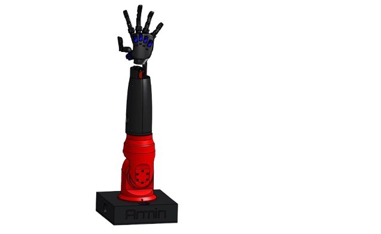

# ARMin - Studying the Effect of Low-Cost Tendon-Drive Prosthetics

A low-cost, fully 3D-printed, tendon-driven robotic arm — built to test how much
of a commercial prosthetic hand's dexterity is reachable for roughly $300 in
parts. ESP32 control, eleven servos, two geared stepper joints, no proprietary
hardware.

Bergen Community College — STEM Research Center · Summer 2026



## What's in here

| Path | What it is |
|------|------------|
| `firmware/` | On-arm ESP32 firmware. Hosts a web portal: one slider per axis + per-stepper zeroing. |
| `docs/PROTOCOL.md` | The control protocol — axis table, endpoints, power and stepper wiring. Source of truth. |
| `docs/` | Research paper, poster, and presentation (PDF). |
| `cad/` | Full-assembly STEP export + link to the live Onshape model. |
| docs/bom.md | Informal electronics parts list. |

## How it works

The ESP32 is the whole controller. It hosts a captive-portal web UI over its own
WiFi access point and owns the target position of every joint — eleven servos on
a PCA9685, plus two NEMA 17 stepper joints at the elbow (64:1 extension, 4:1
roll). There is no companion app and no external computer in the loop. Full axis
map, limits, and wiring are in [`docs/PROTOCOL.md`](docs/PROTOCOL.md).

## Build it

### Hardware
See [docs/bom.md](docs/bom.md) for the electronics and `cad/`
for the mechanical model — the live Onshape document and a STEP export you can
open or convert (to STL for printing, etc.) in any CAD tool.

### Firmware — build & flash
1. Install [PlatformIO](https://platformio.org/) — the VS Code extension is
   easiest (search "PlatformIO IDE" in Extensions).
2. Clone the repo:
```
   git clone https://github.com/trydell29/Studying-the-efficacy-of-Low-Cost-Tendon-Driven-Prosthetics.git
```
3. In VS Code, open the **`firmware/`** folder. PlatformIO detects
   `platformio.ini` and, on the first build, downloads the pinned libraries
   automatically.
4. *(Optional, development only)* To also reach the board over your own WiFi at
   `http://ara.local`, create a secrets file and fill in your 2.4 GHz network:
```
   cp firmware/include/Wifi_secrets.example.h firmware/include/wifi_secrets.h
```
   `wifi_secrets.h` is gitignored and never committed. Skip this and the board
   runs on its own access point alone — which is how the arm operates normally.
5. Connect the ESP32 by USB, then **Build** (✓) and **Upload** (→) from the
   PlatformIO toolbar.
6. Open the Serial Monitor at **115200** baud. You should see `AP up at
   192.168.4.1`.
   
### Operate it
1. Power the arm from the 4S LiPo.
2. On a phone or laptop, join the WiFi network **`ARA-HAND`** (open, no password).
3. Browse to **http://192.168.4.1**. The portal loads with one slider per axis
   and a zero button per stepper.
4. **Before every session:** set both stepper joints to mechanical neutral by
   hand, then press each stepper's zero button. The steppers are open-loop and
   drift is cumulative — see `PROTOCOL.md` §4.
5. Move the sliders to drive the arm. (If you set up STA mode in step 4 of the
   flash section, you can instead reach the portal at http://ara.local.)

## Research

The paper, poster, and presentation in `docs/` cover the design rationale,
the GRASP-taxonomy dexterity evaluation, the payload method, and the cost
comparison against commercial prosthetic hands.

## Credits

**Team:** Tyler Rydell · Tristan Vallestero · Julia Licameli · Nadia Kim · Semih Coban · Tatiana Jara
**Faculty advisor:** Dr. Yolanda Sheppard
**Bergen Community College — STEM Research Center**

## License

Everything in this repository is **MIT-licensed** (see [`LICENSE`](LICENSE)) —
the firmware and the CAD — **except** the research paper, poster, and
presentation in `docs/`, which are **© 2026, all rights reserved**
(see [`docs/NOTICE.md`](docs/NOTICE.md)).
